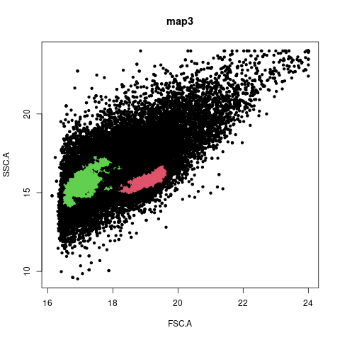

------------------------------------------------------------------------

# Overview

This pipeline converts FSC files to CSV files and merge the multiple CSV files into
one big file. It also create visualizations for every time map given by the user.
The visualization is a plot from the HDBscan algorithm. Last, the pipeline calculates
statistics between two given maps and save the results in two CSV files. 

------------------------------------------------------------------------

# Computer ready for snakemake

## Directories
The pipeline contains four maps in data/. Depending how many time stamps you got, delete or 
create extra maps with the structure data/map{number}/csv/. The second step is to upload the
FSC files with the respective maps. For example data/map1/A04.fcs/csv/. 

config file (config/config.yaml):
Add or remove paths based on your decision you made in the directories. 
If you need five maps it'll look like this: 
paths: ['data/map1', 'data/map2', 'data/map3', 'data/map4', 'data/map5']

Last preparation step is to change or keep files_to_compare argument.
Select two maps you want to compare and get the results. Only thing to
keep in mind is the oldest map needs to be specify first. 
Example if the experiment start at map1:
files_to_compare : ['data/map1', 'data/map2']

## Collect files

Required files:

-   FCS files retrieved from a cytoflow meter 

It is possible to use the example files. The files are available in the
FACS_Data directory. You only need them to move them in the correct
directory, mentioned above.

If you want to check example output take a look in the map example_output/ 

------------------------------------------------------------------------

## Installing snakemake

Required software:

executed on a linux system.

R v4.0.4  
Python v3.9.2
snakemake 6.15.5

`python3 -m venv {path/to/new/virtual/environment} #create a virtualenv`
 
`source {path/to/new/virtual/environment}/bin/activate #activate the virtualenv`  
`pip3 install snakemake {name}`

------------------------------------------------------------------------

## Execute snakemake:

if virtual environment is not activated:
`source {path/to/new/virtual/environment}/bin/activate`

Make sure you're in the pipeline directory:
`cd pipeline/`

First unlock current work directory with:
`snakemake --unlock`

Starting pipeline:
`snakemake -s workflow/Snakefile -c 8`
-s <- specifying snakefile
-c <- number of cores
------------------------------------------------------------------------

## Example output HDBscanner algorithm

------------------------------------------------------------------------

# What do rules do?

-   convert.smk
    -   **rule download_packages:** downloads the needed R packages for
    the pipeline.
    - **rule convert_to_csv:** converts all FCS files to CSV and merge
    all CSV files into one big file for each time stamp.
-   hdbscan.smk
    -   **rule HDBscanner:** execute the HDBscanner algorithm and produce n number of plots.
-   statistics.smk
    -   **rule statistics:** calculates statistics between two given files and saves it in
    two csv files.

------------------------------------------------------------------------

# Contact

e-mail:  <p.visser@st.hanze.nl> <l.r.meulenkamp@st.hanze.nl> <r.d.heins@st.hanze.nl>

# Credits

[Snakemake](https://snakemake.readthedocs.io/en/stable/index.html)
